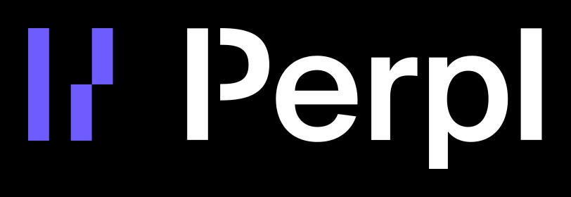
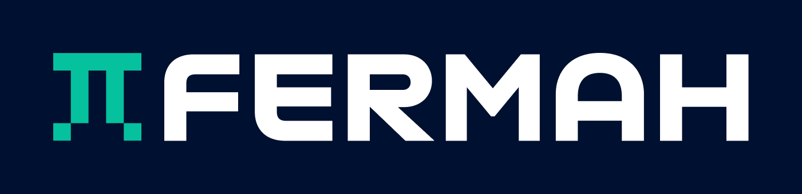
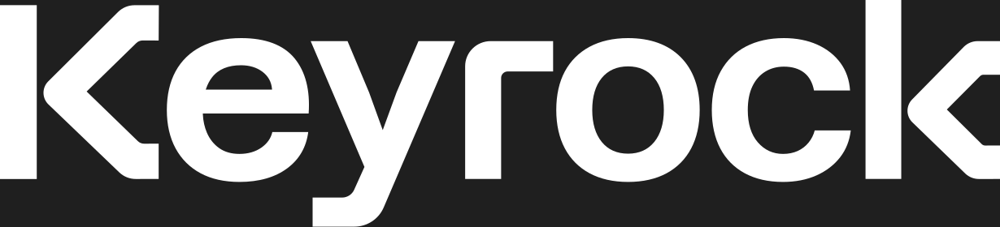

# 👋 Hey there! I'm Sébastien

I build battle-tested systems across high-frequency trading, decentralized exchanges, and on-chain zero-knowledge proof markets — and the teams that own them.

I started out in safety-critical embedded systems for aerospace (helicopter engine controllers, avionics data buses, flight-management systems) before moving into crypto.

I'm currently working at [Perpl](https://perpl.xyz), a perpetual-futures DEX built on the Monad blockchain.

📬 Let's connect! [LinkedIn](https://www.linkedin.com/in/sebastien-vaussier)&nbsp;|&nbsp;[Website](https://sebastien.vaussier.fr)

## 💼 Experience

&nbsp;
&nbsp;
&nbsp;
&nbsp;

## 🪄 Tech Stack I Work With

I'm currently using: 
 

And I also worked with: 

## ⚡️ My projects

### Exploratory projects

- [Matching engine MVP](https://github.com/svaussier/matching-engine-mvp) 🦀: A low-latency, allocation-free CLOB (central limit order book) matching engine with HDR tail-latency benchmarks.
- [BTC quoter](https://github.com/svaussier/btc_quoter) 🦀: Real-time BTC market-making quoter.
- [REVM experimentation](https://github.com/svaussier/revm-experimentation) 🦀: Bypass smart contract locks with REVM storage manipulation.

### Side projects

- [I•alreadyknew•it](https://i.alreadyknew.it): Notarize documents on the blockchain.
- [HighKholle](https://www.highkholle.fr): Note-sharing platform with a LaTeX/Markdown editor for math students in <i>Classes Préparatoires</i> (in 🇫🇷).
